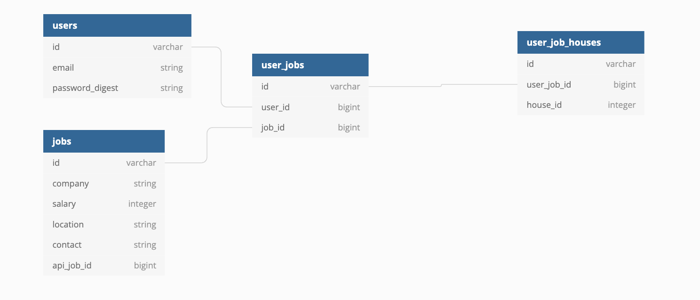

# JOBHOUSE

## Available Endpoints
  + GET `/search/jobs?city=WHATEVER`
    + Returns a list of jobs matching the city param
  + Get `/users?email=someemailadress.com`
    + returns the specific user requested by email address, if one does not exist, creates a new one and returns that user
  + Post `/jobs`
    + creates a job entry in our database, or locates on if it already exists, and assigns a relationship to an existing userS

## Versions
* Ruby version - 2.7.2
* Rails - 5.2.7

## DB Schema

## CONTRIBUTORS
* [Aedan](https://github.com/aedanjames)
* [Eldridge](https://github.com/Eldridge-Turambi)
* [Austin](https://github.com/AustinCMoore)
* [Sam](https://github.com/samlsmith424)
* [Richard](https://github.com/RichardLaBrecque)
